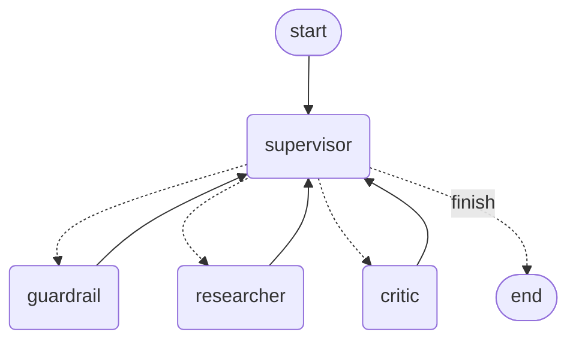

# Research, Critique, Revise

A FastAPI service running a four-agent LangGraph, structured as a hub and
spoke: a **Supervisor** is the first agent every query reaches, and it
decides -- with a real LLM call, every time -- which specialist acts next.
Researcher and Critic never hand off to each other directly; they always
return to the Supervisor, which routes again. Every agent calls
[Groq](https://console.groq.com)'s SDK directly -- LangGraph provides the
graph, not the model calls; no LangChain LLM wrapper anywhere.

## How it works

- **Supervisor** is the entry point and the hub. Its first job is triage:
  reading the query itself and judging whether it looks like it might be out
  of bounds. Most queries are ordinary and go straight to Researcher.
- **Guardrail** is a secondary, deeper check -- only reached when the
  Supervisor's own triage flags a query as worth it, carrying the
  Supervisor's specific reason for the flag. It is not run on every query,
  and it is only reachable as the Supervisor's very first decision: once a
  draft exists, Guardrail is no longer in the option set, so it can't be
  invoked mid-flow. A block ends the run with a refusal.
- **Researcher** drafts an answer, calling a web-search tool when the
  question needs current or specific facts, then returns to the Supervisor.
- **Critic** grades the draft and returns a typed verdict (`approved` /
  `needs_revision`) plus concrete feedback, then returns to the Supervisor.
  A `needs_revision` verdict is usually routed back to Researcher, capped at
  two passes -- enforced deterministically regardless of what the Supervisor's
  LLM call proposes, so the loop always terminates.
- Once the Supervisor routes to "finish," it synthesises the final answer
  itself and streams it token by token.

Every step -- the Supervisor's triage, Guardrail's decision when it runs,
each subsequent routing choice, each draft, the Critic's verdict, and every
token of the final answer -- is streamed to the client as it happens, not
held back until the whole thing finishes.



That diagram is generated straight from the compiled graph
(`graph.get_graph().draw_mermaid()`), not drawn by hand.

## The Supervisor's decision, not a fixed edge

Earlier versions of this service ran Guardrail unconditionally first, as a
fixed precondition, and only handed the *approved draft* to the Supervisor at
the very end, for formatting -- the Supervisor never actually decided
anything. Per review, that's now inverted: the Supervisor is the first agent
to see the query and decides for itself, case by case, whether Guardrail's
deeper check is even warranted.

That triage judgment -- like every other routing choice -- is validated
against the actual state before being trusted. Two backstops exist
specifically because they were caught by testing, not assumed safe:

1. **The revision loop can't run forever.** The cap is enforced in code
   (`_validated_next`), regardless of what the Supervisor's LLM proposes.
2. **An unreadable routing decision escalates, it doesn't skip scrutiny.**
   Early on, a parse failure on the routing response defaulted to
   `"researcher"` -- for one malicious test query, that meant a failed parse
   silently bypassed Guardrail entirely, saved only by the Researcher model's
   own independent refusal. The fallback now defaults to `"guardrail"`
   instead: safe everywhere (it's only honored before a draft exists; every
   other stage computes its own correct next step regardless), and
   specifically protective exactly where the failure occurred.

The LLM decides; the state has the final say.

## Project layout

```
app/
  main.py         FastAPI app, POST /chat/stream -> NDJSON stream of AgentEvent
  service.py      Runs the graph, turns node updates into events, streams the final synthesis
  graph.py        The LangGraph StateGraph: Guardrail/Supervisor/Researcher/Critic nodes and routing
  state.py        GraphState (the graph's shared state)
  schemas.py      ChatRequestPayload, AgentEvent, SupervisorRoutingDecision, CritiqueVerdict, GuardrailVerdict
  prompts.py      Raw prompt strings, one set per agent (including the Supervisor's router and synthesiser)
  tools.py        The Researcher's web-search tool
  exceptions.py   AgentError, GuardrailBlockedError, UpstreamProviderError
  llm_client.py   The single Groq client every agent calls through
```

## Setup

Requires Python 3.9+.

```bash
python3 -m venv .venv
source .venv/bin/activate
pip install -r requirements.txt
cp .env.example .env   # fill in GROQ_API_KEY -- free tier at console.groq.com
```

## Running it

```bash
uvicorn app.main:app --reload --port 8000
```

```bash
curl -N -X POST http://127.0.0.1:8000/chat/stream \
  -H "Content-Type: application/json" \
  -d '{"query": "What caused the 2008 financial crisis?"}'
```

The response is newline-delimited JSON (`application/x-ndjson`) -- each line
is one validated `AgentEvent`:

```json
{"agent":"supervisor","type":"status","content":"Routing to researcher: ordinary factual question"}
{"agent":"researcher","type":"draft","content":"..."}
{"agent":"supervisor","type":"status","content":"Routing to critic: Draft exists but has not yet been reviewed"}
{"agent":"critic","type":"verdict","content":"Approved."}
{"agent":"supervisor","type":"status","content":"Routing to finish: Critic approved the draft"}
{"agent":"supervisor","type":"token","content":"The"}
{"agent":"supervisor","type":"token","content":" 2008"}
{"agent":"supervisor","type":"final","content":""}
```

An ordinary question like this never touches Guardrail. One that the
Supervisor's own triage flags looks like this instead:

```json
{"agent":"supervisor","type":"status","content":"Routing to guardrail: User requests instructions for violent wrongdoing"}
{"agent":"guardrail","type":"status","content":"Query blocked: Disallowed content: instructions for violent wrongdoing"}
{"agent":"supervisor","type":"status","content":"Routing to finish: Disallowed content: instructions for violent wrongdoing"}
{"agent":"supervisor","type":"refusal","content":"Disallowed content: instructions for violent wrongdoing"}
```

A blocked query short-circuits to a `refusal` event; an unrecoverable
failure ends the stream with an `error` event -- the connection never just
drops with a raw traceback.

### In VS Code

Open the folder, then Run and Debug (`Cmd+Shift+D`) -> **"Run API
(uvicorn)"** -> press play. The interpreter is pre-set to `.venv` in
`.vscode/settings.json`.

## Design notes

- **LangGraph is the orchestration layer; Groq's SDK is the model layer.**
  They're independent choices -- using LangGraph for real graph structure
  doesn't require routing model calls through LangChain's `ChatOpenAI`
  wrapper, and this service deliberately doesn't.
- **The Supervisor routes from inside the graph, and synthesises from
  outside it.** Routing is a graph node, visited repeatedly -- that's what
  makes it a real decision at every hop rather than a one-time dispatch. The
  final answer is a separate streamed call made once the Supervisor has
  routed to "finish," outside the graph, so the verified token-streaming
  mechanism stays independent of the routing logic. Matches "Supervisor
  routes, synthesises, streams; it does not query stores directly."
- One provider, no fallback switch -- `GROQ_MODEL` in `.env` picks the model.
- Prompts are plain strings in `prompts.py`; the code that fills them in and
  sends them to the model lives beside the LLM calls in `graph.py` /
  `service.py`, not behind a templating object.
- Typed exceptions (`exceptions.py`) at the one boundary that matters: the
  streaming endpoint never lets a raw exception truncate the response --
  a blocked query becomes a `refusal` event, anything else unrecoverable
  becomes a typed `error` event.
