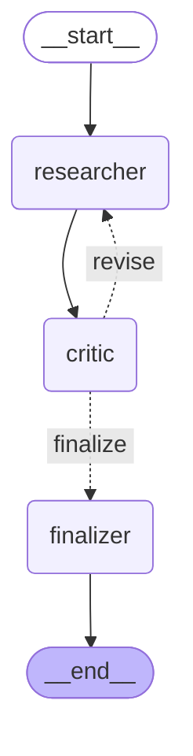

# LangGraph + LangChain Multi-Agent Demo

A small multi-agent flow built with [LangGraph](https://github.com/langchain-ai/langgraph)
and [LangChain](https://github.com/langchain-ai/langchain), run from the CLI.

## What it does

Given a question, three agents collaborate through a real `StateGraph`:

- **Researcher** drafts an answer, optionally calling a web-search tool
  (`DuckDuckGoSearchRun`) when it needs current or specific facts.
- **Critic** reviews the draft against the question and returns a typed
  verdict (`approved` / `needs_revision`) plus actionable feedback, using
  LangChain's `with_structured_output`.
- If the verdict is `needs_revision`, control loops back to the Researcher
  with the critique (capped at 2 revision passes so it can't loop forever).
  Once approved, or the cap is hit, **Finalizer** formats the answer for
  output.



This diagram was generated directly from the compiled graph
(`graph.get_graph().draw_mermaid()`), not drawn by hand — see
`tests/test_graph_structure.py` for the programmatic assertion of the same
shape.

## Setup

Requires Python 3.9+.

```bash
python3 -m venv .venv
source .venv/bin/activate
pip install -r requirements.txt
cp .env.example .env   # then fill in OPENAI_API_KEY (or switch to anthropic)
```

## Running it

```bash
python -m src.cli --query "What caused the 2008 financial crisis?"

# --verbose streams each agent's step to stderr, including any revision loop,
# so you can watch the graph execute rather than just see the final answer:
python -m src.cli --query "What caused the 2008 financial crisis?" --verbose
```

By default the LLM is OpenAI's `gpt-4o-mini` (`LLM_PROVIDER=openai` in
`.env`). Set `LLM_PROVIDER=anthropic` and `ANTHROPIC_API_KEY` to use Claude
instead, or `LLM_PROVIDER=groq` and `GROQ_API_KEY` to use Groq's free tier
(`openai/gpt-oss-20b` by default) — see `src/agents/llm.py`. Groq exposes an
OpenAI-compatible endpoint, so it reuses `ChatOpenAI` pointed at
`https://api.groq.com/openai/v1` rather than needing a separate integration;
get a free key at [console.groq.com](https://console.groq.com).

### Running it without an API key (`--mock`)

```bash
python -m src.cli --mock --verbose
```

`--mock` swaps in `MockChatModel` (`src/agents/mock_llm.py`) instead of a
real provider: no API key, no network call, fully offline. It's
deterministic — the Critic always rejects the first draft and approves the
second — so every run visibly exercises the `critic -> researcher` loop, not
just the happy path. This is the same graph, same nodes, same conditional
edges; only the model each node calls is swapped, via `LLM_PROVIDER=mock`
(the same seam `llm.py` already uses to switch between OpenAI and
Anthropic).

### Running it in VS Code

Open this folder in VS Code (Python extension required). The interpreter is
pre-set to `.venv/bin/python3` (`.vscode/settings.json`), so it should be
picked up automatically — if not, `Cmd+Shift+P` -> "Python: Select
Interpreter" -> the one under `.venv`.

Open the **Run and Debug** panel (`Cmd+Shift+D`) and pick a configuration
from the dropdown, then press the green run arrow (or `F5`):

- **Run mock demo (no API key)** — runs `--mock --verbose`, exactly the
  command above.
- **Run live (needs API key in .env)** — runs a real query against whichever
  provider `.env` configures.
- **Run tests** — runs the full `pytest` suite.

All three are defined in `.vscode/launch.json` and run in the integrated
terminal, so the output looks the same as running the commands by hand.

## Project layout

```
src/
  cli.py              CLI entrypoint (argparse, no web framework)
  graph/
    state.py           Shared GraphState (TypedDict)
    nodes.py            researcher_node, critic_node, finalizer_node
    routing.py           Conditional routing after the critic
    graph.py              Builds and compiles the StateGraph
  agents/
    llm.py               get_llm() provider factory (openai/anthropic/mock)
    mock_llm.py            Offline scripted model behind LLM_PROVIDER=mock
    prompts.py               Distinct system prompt per agent
    tools.py                    The Researcher's web-search tool
    schemas.py                    CritiqueVerdict (Pydantic, for structured output)
tests/
  test_graph_structure.py  Asserts the compiled graph's nodes/edges (no LLM)
  test_graph_run.py         End-to-end run against a mocked LLM (no API key needed)
.vscode/
  launch.json               Run/Debug configurations (mock demo, live, tests)
  settings.json               Points VS Code at .venv/bin/python3
```

## Verifying this is genuinely multi-agent, not one prompt reused

- `src/agents/prompts.py` — two separate system prompts, two separate output
  contracts (free-text draft vs. a typed verdict).
- `src/graph/graph.py` — a real `add_conditional_edges` on `critic`, not an
  `if` statement in Python calling functions directly.
- `tests/test_graph_structure.py` — asserts the compiled graph's edges
  programmatically.
- `tests/test_graph_run.py` — runs the full graph against a fake model that
  fails the first critique on purpose, so the `critic -> researcher` loop is
  exercised, not just theoretically reachable.
- `--verbose` prints each node's output live, so a real revision loop is
  visible in the terminal on a question the model gets wrong on the first
  pass.

## Deliberately out of scope

No web server, no database or vector store, no persistent memory/checkpointing,
no Docker/CI, no multi-provider plugin system beyond a 4-line factory
function. This is a focused demo of a LangGraph multi-agent flow, not a
production service.

## Tests

```bash
pytest tests/
```

Both test files run without a live API key: `test_graph_structure.py` never
touches the LLM, and `test_graph_run.py` monkeypatches `get_llm`.
