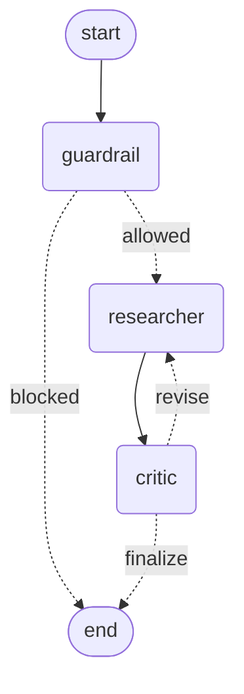

# Research, Critique, Revise

A FastAPI service where a Supervisor runs a three-agent LangGraph
(Guardrail &rarr; Researcher &rarr; Critic, with a real revision loop), then
streams the answer to the client as it's generated. Every agent calls
[Groq](https://console.groq.com)'s SDK directly -- LangGraph provides the
graph, not the model calls; no LangChain LLM wrapper anywhere.

## How it works

- **Guardrail** checks the query against policy before anything else runs.
  A blocked query ends the graph immediately; nothing else executes.
- **Researcher** drafts an answer, calling a web-search tool when the
  question needs current or specific facts.
- **Critic** grades the draft and returns a typed verdict (`approved` /
  `needs_revision`) plus concrete feedback. `needs_revision` loops back to
  the Researcher, capped at two passes.
- Once approved, the **Supervisor** (outside the graph) synthesises the
  final answer and streams it token by token.

Every step -- the Guardrail's decision, each draft, the Critic's verdict,
and every token of the final answer -- is streamed to the client as it
happens, not held back until the whole thing finishes.



That diagram is generated straight from the compiled graph
(`graph.get_graph().draw_mermaid()`), not drawn by hand.

## Project layout

```
app/
  main.py         FastAPI app, POST /chat/stream -> NDJSON stream of AgentEvent
  service.py      Supervisor: runs the graph, turns updates into events, streams the final synthesis
  graph.py        The LangGraph StateGraph: Guardrail/Researcher/Critic nodes and routing
  state.py        GraphState (the graph's shared state)
  schemas.py      ChatRequestPayload, AgentEvent, CritiqueVerdict, GuardrailVerdict
  prompts.py      Raw prompt strings, one set per agent
  tools.py        The Researcher's web-search tool
  exceptions.py   AgentError, GuardrailBlockedError, UpstreamProviderError
  llm_client.py   The single Groq client every agent calls through
```

## Setup

Requires Python 3.9+.

```bash
python3 -m venv .venv
source .venv/bin/activate
pip install -r requirements.txt
cp .env.example .env   # fill in GROQ_API_KEY -- free tier at console.groq.com
```

## Running it

```bash
uvicorn app.main:app --reload --port 8000
```

```bash
curl -N -X POST http://127.0.0.1:8000/chat/stream \
  -H "Content-Type: application/json" \
  -d '{"query": "What caused the 2008 financial crisis?"}'
```

The response is newline-delimited JSON (`application/x-ndjson`) -- each line
is one validated `AgentEvent`:

```json
{"agent":"guardrail","type":"status","content":"Query allowed."}
{"agent":"researcher","type":"draft","content":"..."}
{"agent":"critic","type":"verdict","content":"Approved."}
{"agent":"supervisor","type":"token","content":"The"}
{"agent":"supervisor","type":"token","content":" 2008"}
{"agent":"supervisor","type":"final","content":""}
```

A blocked query short-circuits to a `refusal` event; an unrecoverable
failure ends the stream with an `error` event -- the connection never just
drops with a raw traceback.

### In VS Code

Open the folder, then Run and Debug (`Cmd+Shift+D`) -> **"Run API
(uvicorn)"** -> press play. The interpreter is pre-set to `.venv` in
`.vscode/settings.json`.

## Design notes

- **LangGraph is the orchestration layer; Groq's SDK is the model layer.**
  They're independent choices -- using LangGraph for real graph structure
  doesn't require routing model calls through LangChain's `ChatOpenAI`
  wrapper, and this service deliberately doesn't.
- **The Supervisor sits outside the graph.** It runs the graph, streams
  each node's progress as it happens, and does its own separate streamed
  call to synthesise the final answer -- matching "Supervisor routes,
  synthesises, streams; it does not query stores directly."
- One provider, no fallback switch -- `GROQ_MODEL` in `.env` picks the model.
- Prompts are plain strings in `prompts.py`; the code that fills them in and
  sends them to the model lives beside the LLM calls in `graph.py` /
  `service.py`, not behind a templating object.
- Typed exceptions (`exceptions.py`) at the one boundary that matters: the
  streaming endpoint never lets a raw exception truncate the response --
  a blocked query becomes a `refusal` event, anything else unrecoverable
  becomes a typed `error` event.
