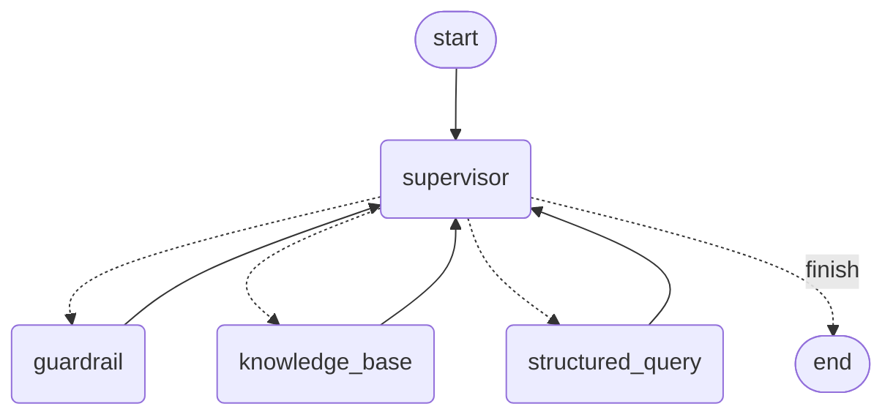

# ConversationOrchestrator

A pure, in-process agentic workflow: no API, no server, no real external
tool/database/search connections. Those are explicitly deferred -- this is
the core supervised workflow only, ready to have real tool integrations
added later without changing this package's shape.

`ConversationOrchestrator` is the only public entry point:

```python
from orchestrator.conversation_orchestrator import ConversationOrchestrator
from orchestrator.schemas import ConversationRequest

orchestrator = ConversationOrchestrator()
response = orchestrator.handle(ConversationRequest(query="How many emails did I get from Acme last month?"))

print(response.answer)
print(response.metadata)  # which agents ran, what they produced, any errors
```

## How it works



(Generated straight from the compiled graph -- `graph.get_graph().draw_mermaid()`.)

- **Supervisor** is the hub. Its very first move, unconditionally, is
  Guardrail -- not a choice, per the spec's "before other agents proceed."
  Every subsequent visit is a real LLM call deciding between Knowledge Base,
  Structured Query, both (one after the other), or finishing, validated
  against what's already run so it can't loop forever or repeat a step.
- **Guardrail** checks five things: scope, safety, privacy, prompt-injection
  risk, and policy. A block ends the run with a plain refusal.
- **Knowledge Base** turns a question into a `RetrievalIntent` -- a
  rewritten query, filter hints, and a result count a real hybrid search
  would use. No search runs.
- **Structured Query** turns a data-oriented question into a
  `StructuredQueryIntent` -- one named query (`count_records`,
  `list_records`, `thread_lookup`) plus typed parameters. No database call
  runs.
- Once Supervisor decides to finish, it synthesises everything that was
  prepared into one honest answer -- describing the plan, never fabricating
  a real result, since no real result exists yet.

## What's deliberately different from the other module in this repo

`app/` (the FastAPI service) and `orchestrator/` (this package) were built
under different, explicit instructions, so a few things differ on purpose:

- **LangChain handles model invocation here.** `app/` calls Groq's SDK
  directly, by explicit instruction on that task. This task explicitly asks
  for "LangChain for prompt handling, model invocation, and agent
  composition," so prompts are `ChatPromptTemplate` objects and calls go
  through `ChatGroq` + `.with_structured_output(...)`.
- **Guardrail is unconditional, not Supervisor-triaged.** The FastAPI
  service's Supervisor decides *whether* to bother checking Guardrail. This
  spec says Guardrail runs "before other agents proceed" -- every request,
  no exceptions.
- **No streaming, no NDJSON events.** `handle()` returns one
  `ConversationResponse` synchronously -- there's no client connection to
  stream to at this stage.

## Verified, not assumed

- The compiled graph's actual shape matches the diagram above (checked via
  `draw_mermaid()`, not just described).
- An ordinary factual question routes to Knowledge Base and produces a real
  `RetrievalIntent`.
- A data-oriented question (mentioning a sender, a date range, and
  attachments) routes to *both* Knowledge Base and Structured Query, and the
  `StructuredQueryIntent` produced (`count_records` with `sender`,
  `date_range`, `has_attachments` parameters) matches the exact shape your
  team's own architecture doc gives as its example.
- A policy-violating request is blocked, and neither Knowledge Base nor
  Structured Query ever run.
- **A real gap was found and fixed during verification**: the first
  Guardrail prompt only covered safety categories and, tested against "how
  many emails did I receive from Acme Corp last month," blocked it three times
  running as a "personal data" violation -- a false positive on exactly the
  kind of self-referential query this workflow exists to handle. The prompt
  was rewritten to explicitly cover all five checks the spec asks for
  (scope, safety, privacy, prompt-injection, policy), with the specific
  distinction that a request about the requester's *own* records is
  ordinary access, not a privacy violation. Re-verified against that case
  plus four others (an ordinary question, a genuine safety block, a
  genuine third-party-privacy block, and a prompt-injection attempt) --
  all five now resolve correctly.
- A simulated failure inside Knowledge Base doesn't crash the workflow --
  the error is recorded, and the Supervisor's synthesis reports the failure
  to the user honestly instead of hiding it.
